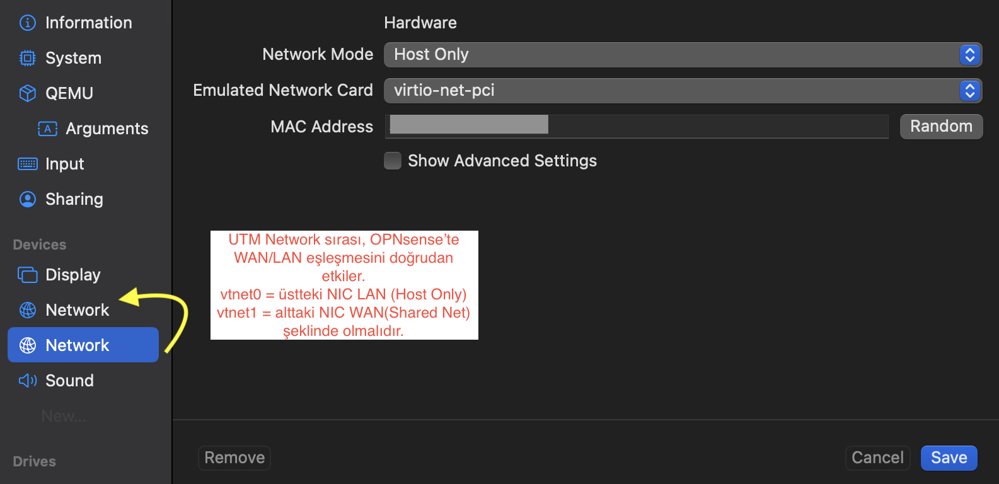

# UTM + OPNsense (Apple Silicon) — Network Order Fix (WAN/LAN)

Amaç: WAN = Shared Network, LAN = Host Only olacak şekilde OPNsense interface mapping’in doğru oturması.

## Lab Topology

- Host: macOS (Apple Silicon, M3)
- Hypervisor: UTM
- Firewall: OPNsense
- Client: Windows 11

Traffic flow:
Windows 11 → OPNsense (LAN) → OPNsense (WAN) → Internet

## Problem
OPNsense WAN/LAN doğru görünmesine rağmen:
- Windows internete çıkmıyordu
- OPNsense 8.8.8.8 ping fail / timeout olabiliyordu
- Web GUI erişimi tutarsızdı

## Root Cause
UTM’de **Network kartlarının sırası**, OPNsense’in `vtnet0/vtnet1` eşleşmesini etkiliyor.

## Fix
UTM’de OPNsense VM için network sırası şöyle olmalı:
- **Network (üstte)** = `Host Only`  → LAN
- **Network (altta)** = `Shared Network` → WAN

> Bu değişiklikten sonra:
> - OPNsense 8.8.8.8 ping aldı
> - Windows, 192.168.50.1’i pingleyebildi
> - Trafik düzgün şekilde firewall üzerinden aktı

Önemli Not

UTM, ağ bağdaştırıcılarını sırayla listeler.

OPNsense, arayüzleri (vtnet0, vtnet1) bu sıraya göre atar,
ağ modu adına (Yalnızca Ana Bilgisayar / Paylaşımlı) göre DEĞİL.

Bu nedenle, OPNsense'te WAN/LAN doğru görünse bile,
UTM'deki yanlış bağdaştırıcı sırası yönlendirmeyi sessizce bozabilir.

## Screenshot

